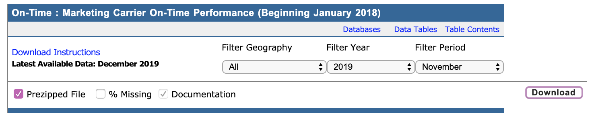
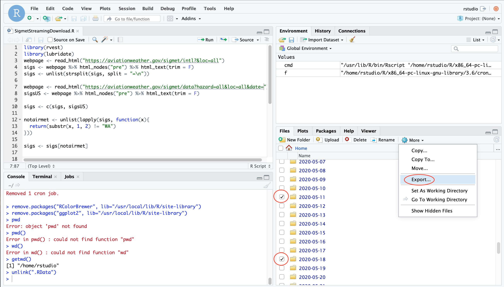

# Installing package
You'll only need to execute this block the first time
```{r eval = FALSE}
## ACTION
# 1. Copy MonaRk folder to a location on your computer

# 2. Install Packages
packages <- c("devtools", "shiny", "shinydashboard", "data.table", "DT", 
                "ggplot2", "plotly", "colourpicker", "leaflet", "lubridate", 
                "sp", "rgeos", "rgdal", "sf", "stringr", "dplyr", "R.utils", 
                "svglite", "lwgeom", "shinythemes", "shinycssloaders", "Imap")
if (length(setdiff(packages, rownames(installed.packages()))) > 0) {
  install.packages(setdiff(packages, rownames(installed.packages())))  
}
# Sometimes you will get stuck in a loop where R will ask to restart in a popup. 
# If you get stuck, say No to restart
```

Change the "/path/to/MonaRk/" and run this block everytime
```{r eval = FALSE}
# 3.  change path to MonaRk (including "MonaRk as last directory")
# IN RMARKDOWN
knitr::opts_knit$set(root.dir = "/path/to/MonaRk/")
# OR 3. For copy paste into R session
# setwd("/path/to/MonaRk/")

# 4. Load MonaRk
devtools::load_all()
```


# Run App
An instruction video is in the Help Tab of the app.
```{r eval = FALSE}
MonaRk::launchApp()
```
Press the stop sign to stop the app and return to R.

# Update Data 
Use the addMondays() function to update data in the app. This should be run every 2 months to ensure there isn't a lapse in data collection.
In order to get it in this form, the directions under the Data Collection and Data Preprocessing sections were followed. 

We have a few types of data:

1. Storm Events (polygons representing storms for the USA in 2019). 
2. Delay Data (weather and ATC delays for flights in the USA in 2019).
3. Sigmet Data (text that represents airspace dangers released from stations around the world).
4. States Data (the state of the airspace every 10 seconds, Mondays UTC, from OpenSky).


## Data Collection

### 1. Storm Events
 The storm events database is released monthly and is 3 months behind the current date. 

The most recent storm data was downloaded on 4/18/20 and contains storms through 1/31/20. There is a three-month delay in this data. It will need to be downloaded again to include more recent storms, then reprocessed, and combined with flight data.

```{r}
## ACTION 
# 1. Go to https://www1.ncdc.noaa.gov/pub/data/swdi/stormevents/csvfiles/ and download the
# file named "StormEvents_details-ftp_v1.0_d2020_c2020MMDD.csv.gz". The last date will be 
# different, but the important thing is that the file name contains "details" and "_d2020_" # OR the current year.
# 2. Unzip the gz file
# 3. Replace the 2020 (or whatever year it is currently) storm file in 
# MonaRk/inst/extdata/raw/rawStorms with the unziped CSV file you just downloaded
```


### 2. Delay Data
The delay data is released monthly, with a two or three-month lag (at the end of March 2020, the most recent data available was Jan 2020).

```{r}
# ACTION
# 1. Look in MonaRk/inst/extdata/raw/rawDelay and find the dates at the end of the files. Ex.
# "On_Time_Marketing_Carrier_On_Time_Performance_(Beginning_January_2018)_2020_1.csv", find 
# the end "2020_1.csv" which represents January 2020. 
# 2. Note which months you'll need to download. Start with the most recent delay file. For 
# example, if "2020_1.csv" is the most recent, download January 2020 AGAIN to ensure you have
# the full months worth of data. Download all the months after this date that is possible.
# 3. Go to https://www.transtats.bts.gov/Tables.asp?DB_ID=120 click Download under Marketing.
```
Use "marketing" since it has additional reports over the reporting option.   


```{r}
#4. Download one month of data at a time, and (important!) select the "Prezipped File" 
# option to get all the fields.
```



Selecting columns sometimes results in the wrong columns being downloaded. 

```{r}
#5. Download a file for each month that needs to be updated, unzip them and open them, 
# and move the CSV files only into inst/extdata/raw/rawDelay.
```


### 3. Sigmet Scraping
A script is set to run every hour on an AWS instance which scrapes international sigmets from https://aviationweather.gov/sigmet/intl?&loc=all and US sigmets from https://aviationweather.gov/sigmet/data?hazard=all&loc=all&date=. The result is a folder for each date, each of which contains 10-20 text files representing regions. The names of the files are unimportant.

```{r}
## ACTION
# 1. Go to http://18.216.88.92/auth-sign-in
# 2. Username: rstudio & Password: i-03765662c5ae43e02
# 3. Look locally in MonaRk/inst/extdata/raw/rawSigmetScraping to see what the latest 
# sigmet date is that has been downloaded 
# 4. Export all Mondays since this date from the RStudio server
```


```{r}
## ACTION CONTINUED
# 5. The name of the zipped download doesn't matter, just unzip and select the date 
# folders and move them into MonaRk/inst/extdata/raw/rawSigmetScraping
```
Sidenote: Sigmets from before 02-09-2020 are from http://aviationwxchartsarchive.com/product/sigmet. Not as many sigmets are captured by this service so we switched to scraping our own.


### 4. States Data
Flight data is hosted on https://opensky-network.org/datasets/states/. Inside the date folders are folders for each hour which contains a csv.tar file. You can download and unzip these manually, or use the function readOpenSkyStates() to run through a day automatically.

Raw states data is too large to be included in the MonaRk package files.
```{r}
# ACTION 
# 1. Proceed to the next step and addMondays() will download states data automatically.
```


## Add Mondays function
You will need a large amount of memory to run this function. For each week that has passed since updating the data, this function will download about 3GB worth of data. 
```{r eval = FALSE}
## ACTION: change path for data download and app folder
appDataDir <- "path/to/MonaRk"
statesDataDir <- "path/to/download"

addMondays(appDataDir, statesDataDir)
```
If you've forgotten to update any of the simget, storm event, or delay data, an error will tell you which data to download into which folder.


### After running the addMondays function
Many large states files will likely be downloaded to the Directory you defined as "statesDataDir". Once addMondays() has finished processing, you can navigate to "statesDataDir" and remove any files with names in the format states_YYYY-MM-DD.csv. 

### Check out the app with the new data
```{r eval = FALSE}
MonaRk::launchApp()
```
Does the data appear to be updated? Does the date selection on the last tab include recent dates? If something went wrong, the data before updating will be stored in MonaRk/inst/extdata/cleaned with the suffix _old.RDS. You can restore the old data by deleting any .RDS files in MonaRk/inst/extdata/cleaned without the suffix _old.RDS, and removing "_old.RDS" from the names of the files. The app then will use the old data files. 

### Updating the online app
If the code for the app is changed, or if you'd like to distribute the app with updated data, you can publish a new version of the app on shinyapps.io. You can find a guide here: https://towardsdatascience.com/how-to-publish-a-shiny-app-example-with-shinyapps-io-ec6c6604d8. ONLY push 1. "app.R", 2. the "www" folder, 3. the "appData" folder, and 4. the "R" folder. The setup should take ~15 minutes and the publishing itself takes a few hours because of large data files.

### Conducting your own analysis 
The parsed data could be helpful for many other projects. 
1. Parsed US storm events data exists in: MonaRk/inst/extdata/cleaned/stormsGeo.RDS
2. Parsed US delay data exists in: MonaRk/inst/extdata/cleaned/delayGeo.RDS
3. Parsed sigmet data exists in: MonaRk/appData/allsigs.RDS
4. Parsed flight data exists as two files. Read it into R with the following code:
```{r eval = FALSE}
geomatrix_distcovars <- readFlightgeoFromFolder(geoFolder = "inst/extdata/cleaned/geo")
flightgeo_distcovars <- readFlightgeoFromFolder(dfFolder = "inst/extdata/cleaned/df")
flightgeo_distcovars <- compareFlights(flightgeo_distcovars)

flightgeo <- createFlightgeo(flightgeo_distcovars, geomatrix_distcovars)
```

